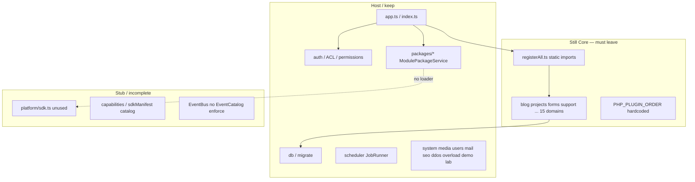

> **Historical architecture/audit record.**  
> Do not use as the current implementation guide.  
> See [`architecture/CURRENT.md`](architecture/CURRENT.md) · [`node-package-host.md`](node-package-host.md) · [`node-domain-native-sdk.md`](node-domain-native-sdk.md).

# Node.js architecture audit (post PHP extraction)

**Date:** 2026-08-08 (audit) · **Foundation update:** 2026-08-08  
**Scope:** `runtime-node/`, `mcp-cms/`, related Node scripts (`scripts/build-module.js`, `scripts/ci-sdk-check.js`, `scripts/behavior/*`, `scripts/jasefly/*`)  
**Original mode:** read-only audit. **Follow-up:** NODE PACKAGE HOST FOUNDATION implemented — see `docs/node-package-host.md`.

**NODE PACKAGE HOST: READY**  
**DOMAIN EXTRACTION: COMPLETE** (15/15 package-owned; see `docs/node-domain-extraction.md`)  
**Legacy Core domains:** removed from `registerAll.ts` / `moduleNames.ts`

---

## Executive verdict

PHP now hosts 15 domains as ZIP packages via Platform SDK. Node VPS runtime still **hardcodes and in-process-registers** those same domains as TypeScript modules (`registerAll.ts` / `moduleNames.ts`). ZIP lifecycle on Node is **filesystem + DB registry only** — no package backend loader, incomplete Platform SDK binding (`createPlatformContext` unused), migrations still scan `backend/src/Modules`, and `/site` `enabled_plugins` is filtered by a hardcoded slug list.

Unknown package `zed` can be **installed/managed as metadata** via MPM/MCP, but **cannot run APIs, migrations, jobs, or FE assets** without Node source changes.

MCP is largely a **slug-agnostic operator client** (good for lifecycle) with residual **content CRUD catalog** coupling (`blog`/`projects`/`products`) and high-privilege surfaces (`cms_admin_request`, local FS, VPS SSH).

---

## 1. Node architecture map

### 1.1 runtime-node layers

### 1.2 Ownership map (summary)

| Component | Responsibility | Current owner | PHP/Core dep | Module-specific | Coupling 1–10 | Blast | Target | Class |
| --- | --- | --- | --- | --- | --- | --- | --- | --- |
| `app.ts` / `index.ts` | Kernel | Host | Parity shell | No | 8 | High | Keep | **C** |
| `registerAll.ts` / `moduleNames.ts` | Static module graph | Host (wrong) | Mirrors pre-extract PHP | All 15 slugs | 2 | Critical | Dynamic host+package loader | **D** |
| 15 domain `modules/*.ts` | Full domain APIs | Core TS | Reimplements PHP packages | Yes | 3 | Critical | Out of Core / package Node entry | **D** |
| `content.ts` public `/projects` | Projects bleed into Content | Host Content | Domain SQL | Yes | 3 | High | Package / resources | **D** |
| `publicSite.PHP_PLUGIN_ORDER` | `/site` plugin list | Host | Hardcoded order ∩ NODE_MODULE_NAMES | Yes | 3 | High | DB ∪ installed_modules | **D** |
| `packages/*` | ZIP lifecycle | Host MPM | Partial vs PHP | Slug-agnostic | 5 | High | Complete + loader | **B** |
| `platform/sdk.ts` | Package SDK | Platform stub | Unused | No | 2 | High | Real facades + bind | **B** |
| `platform/events.ts` | EventBus | Platform | No EventCatalog | No | 6 | Med | + declare/clearOwner | **B** |
| `JobHandlerRegistry` | Jobs | Host | Package job ids as **noop** | Yes | 4 | Med | Package register | **D** |
| `pluginState` / `softPluginGate` | Enable + Design B | Host | Parity | Generic | 8 | Med | Keep | **A** |
| Auth / MCP auth / SSRF / zipSafe | Security | Host | Parity | No | 8–9 | High | Keep | **A/C** |
| `migrate` plugin SQL path | Discover SQL under `backend/src/Modules` | Host | **Stale after extract** | Yes | 2 | Critical | `storage/modules/*/migrations` | **D** |
| `systemParity` `spawnSync(php)` | Health probes | Host | Assumes PHP binary | No | 4 | Med | Gate/remove on VPS | **E** |
| `portfolio.ts` | Composition stub | Deprecated | Matches PHP | Composition | 6 | Low | Keep/remove later | **E** |
| MCP `cms_module_*` | Remote MPM | Operator client | Host API | Slug-agnostic | 8 | High | Keep | **B** |
| MCP `RESOURCES` / `cms_publish` | Content CRUD catalog | Operator UX | blog/projects/products | Yes | 4 | Med | Generic or shrink | **C** |
| MCP `cms_admin_request` / VPS SSH / local FS | High privilege | Operator | Full admin / remote | No | 2 | Critical | Keep gated; document | **E** |

---

## 2. Dependency graph (critical edges)

| From | To | Kind | Problem |
| --- | --- | --- | --- |
| `registerAll.ts` | `modules/{blog,forms,…}.ts` | static import | Forces Core ownership of extracted domains |
| `publicSite.ts` | `PHP_PLUGIN_ORDER` + `NODE_MODULE_NAMES` | slug whitelist | Unknown `zed` never appears in `/site` |
| Domain modules | SQL tables (`blog_posts`, `forms`, …) | concrete schema | Duplicate SoT vs PHP packages |
| `JobHandlerRegistry` | `analytics.*`, `newsletter.campaign.send`, … | noop aliases | Silent functional gap |
| `migrate.ts` | `backend/src/Modules` | filesystem | Extracted packages have no in-tree Modules SQL |
| `ModuleRegistry` (Node) | `assets_base=/modules/{slug}/` | advertised URL | **No static serve** of package FE |
| `createPlatformContext` | — | dead | Packages cannot bind SDK |
| MCP client | `/admin/modules*`, `/admin/{resource}` | HTTP | Lifecycle OK; CRUD catalog outdated |
| `scripts/behavior/*` | hardcoded module/table lists | test tooling | Parity harness still assumes dual in-tree domains |

---

## 3. Concrete coupling inventory

### 3.1 Node → extracted module slugs (hardcoded)

Evidence: `runtime-node/src/modules/registerAll.ts`, `moduleNames.ts`, `publicSite.ts` `PHP_PLUGIN_ORDER`:

`webhooks`, `comments`, `forms`, `analytics`, `newsletter`, `automation`, `notifications`, `support`, `translate`, `products`, `orders`, `payments`, `registration`, `blog`, `projects` (+ deprecated `portfolio`).

### 3.2 Node → package DB tables

Direct SQL in domain TS modules (non-exhaustive): `blog_posts`, `projects`/`project_categories`, `forms`/`form_submissions`, `comments`, `analytics_*`, `newsletter_*`, `automations`/`automation_runs`, `notifications`, `webhooks`, `support_*`, `translate_cache`, `products`, `orders`/`carts`, `payments_*`, registration settings on `modules`.

### 3.3 Node → filesystem / old bundled paths

- Install root: `storage/modules/{slug}` (OK, generic).
- Plugin migrations discovery: **`backend/src/Modules`** (`db/migrate.ts`) — broken for extracted ZIPs.
- No HTTP handler for public `/modules/{slug}/*` assets (manifest advertises path anyway).

### 3.4 Node → PHP routes / controllers

- Behavioral reimplementation of `/api/v1/...` domains — not PHP class imports.
- Health: `spawnSync('php', …)` in `systemParity.ts` (PHP version/DB probes).

### 3.5 Node → outbound / security

| Path | Status |
| --- | --- |
| Webhooks + `outboundHttp` + `ssrfGuard` | Good |
| `http_ping` job raw `fetch` | **No SSRF guard** (High) |
| ZIP extract jail | Good (`zipSafe.ts`) |
| MCP dual-secret | Good (`mcpRequestAuth.ts`) |

### 3.6 MCP coupling

| Kind | Evidence |
| --- | --- |
| Lifecycle slug-agnostic | `cms_module_*`, `cms_module_release` → `build-module.js` |
| Content catalog | `mcp-cms/src/client.js` `RESOURCES` includes blog/projects/products |
| Publish enum | `cms_publish` blog/projects only |
| Escape hatch | `cms_admin_request` → any `/admin/*` |
| Local FS | upload/media/content-pack `path.resolve` (no repo jail) |
| VPS | `deploy/vps.js` SSH/SCP + env restart command |

---

## 4. Security / runtime boundary map

| Surface | Boundary | Risk |
| --- | --- | --- |
| MCP Bearer / HMAC | Host Auth + `mcpRequestAuth` | Token ≈ super-admin |
| `cms_admin_request` | `/admin/*` path jail only | Package routes callable with MCP token |
| Local MCP FS tools | **No** workspace jail | Agent machine exfil/write |
| VPS deploy | SSH + stamp grammar | Critical remote write |
| Package ZIP install | Host MPM validate + Node zipSafe | Trust host validation |
| Package code execution on Node | **None today** | Positive for RCE; also blocks real packages |
| `http_ping` | Unvalidated URL fetch | SSRF |
| Manifest trust | Health/folder checks | Incomplete vs PHP certify pipeline |

**Do not fix in this phase** — map only.

---

## 5. A / B / C / D / E classification

### A — architecture-safe
zipSafe, ModulePaths jail, MCP auth (runtime + client HMAC), SSRF on webhook path, pluginState, softPluginGate, capabilities JSON load, EventBus core, auth/jwt/password, http envelope.

### B — small generic seam required
ModulePackageService completion (migrations apply, FE serve), ModuleRegistry/Health, `platform/sdk.ts` real facades (mail/scheduler/notifications/http/events/resources), EventCatalog parity, sdkManifest wiring into loader.

### C — host/runtime infrastructure (keep)
system, media, users, access, mail, scheduler, seo, ddos, overload, demo, lab, module-manager, template, db, crud, install, app kernel; MCP sites/throttle/gate/verify transport.

### D — concrete coupling / redesign required
15 domain TS modules; `registerAll` / `moduleNames` / `PHP_PLUGIN_ORDER`; content↔projects/blog bleed; JobHandler package noops; migrate → `backend/src/Modules`; systemParity domain hardcodes; MCP RESOURCES/publish catalog; behavior dual-runtime seed lists.

### E — obsolete / dead / duplicate after PHP extract
portfolio stub (keep until FE composition cleaned); PHP `spawnSync` health on pure Node VPS; assumptions that extracted domains live under `backend/src/Modules`.

---

## 6. Parity analysis (PHP SDK ↔ Node)

| PHP boundary | Node equivalent | Verdict |
| --- | --- | --- |
| Package lifecycle | `packages/*` + module-manager API | Partial — no backend load / migrations apply gap |
| CapabilityRegistry | capabilities JSON + reports | Catalog OK; runtime revoke/provide incomplete for packages |
| EventCatalog / Dispatcher | EventBus only | Missing declare/clearOwner enforcement |
| Content Resources | **Absent** | Blog/projects are concrete modules |
| Mail | `modules/mail.ts` | Host OK; not package SDK |
| Notifications | `modules/notifications.ts` | In-Core domain; not soft facade for packages |
| Scheduler | JobRunner + registry | Package jobs noop |
| HTTP/outbound | Hono + ssrfGuard/outboundHttp | Partial; http_ping hole |
| permissions/access | permissionMiddleware + AccessService | Host OK |
| hostSlots / FE package discovery | runtime-assets JSON | Manifest only; **no asset serve** |
| package-owned routes | — | All routes from static TS |
| enable/disable | pluginState + MPM mirror | OK for rows; domains still always registered in Core |

---

## 7. Package compatibility (15 ZIPs × Node)

| Expectation | Node today |
| --- | --- |
| Install ZIP via MPM/MCP | Yes (metadata + files) |
| Enable/disable mirror | Yes |
| Appear in `/site` enabled_plugins | **Only if slug ∈ hardcoded lists** |
| Run package PHP backend | N/A (Node runtime) |
| Run package Node entry | **No loader** |
| Apply package migrations | **Not in ModulePackageService** (and core migrate looks at wrong path) |
| Serve `frontend-dist` | **No** |
| Scheduler / events / resources | No package binding |

### Unknown package `zed` (key criterion)

| Capability | Without Node source change? |
| --- | --- |
| Build ZIP (`modules-src/zed`) + MCP/CLI install | **Yes** |
| Enable/disable/health/rollback via API/MCP | **Yes** |
| Listed in `/admin/modules`, runtime-assets metadata | **Yes** (if enabled) |
| Listed in `/site` `enabled_plugins` | **No** |
| HTTP API from package entry | **No** |
| Migrations / jobs / EventCatalog / Content Resources | **No** |
| FE `index.js` served at `/modules/zed/` | **No** |
| Soft-gate unknown admin resources | **No** (unless host already generic) |

**Verdict:** Node is a **lifecycle scaffold**, not a package host. Unknown-package criterion **fails** for runtime interaction.

---

## 8. Necessary generic seams (before domain extraction on Node)

1. **Package backend loader** — discover Node entry from manifest; dynamic register; quarantine on failure.  
2. **Real `PlatformContext`** — mail, scheduler/jobs, notifications, http/outbound, events(+catalog), resources, capabilities revoke.  
3. **Static asset serve** — `/modules/:slug/*` with path jail (parity with PHP module-asset).  
4. **Migrations** — apply from `storage/modules/{slug}/migrations` on install; stop scanning extracted paths under `backend/src/Modules`.  
5. **Dynamic plugin catalog** — `/site` enabled_plugins from DB ∪ installed_modules (not `PHP_PLUGIN_ORDER` ∩ hard list).  
6. **Remove Core domain modules** only after package Node impl exists (cohort order below).  
7. **SSRF** — route `http_ping` through ssrfGuard.  
8. **MCP** — optional: shrink RESOURCES/publish; document `cms_admin_request` privilege; FS jail for local paths (ops hardening, not blocking loader).

---

## 9. What NOT to rewrite / transfer

- Do **not** invent a second CMS in Node that copies every PHP class.  
- Do **not** extract Lab/Demo/Ddos/Overload/Mail/Scheduler host from Node as “packages” for aesthetics.  
- Do **not** make MCP re-implement MPM validation — keep thin client.  
- Do **not** force Node Content Resources if VPS will only proxy PHP later — but if Node serves APIs, it needs an equivalent or must stop owning blog/projects.  
- Do **not** cosmetic-rename modules.  
- Do **not** change PHP freeze architecture in this phase.

---

## 10. Migration / refactor order (max decoupling / min risk)

1. **Stop bleeding:** package migration discovery → `storage/modules/*/migrations`; gate/remove `spawnSync(php)` on VPS health.  
2. **Serve package FE assets** + path jail.  
3. **Implement PlatformContext facades** + wire into future loader.  
4. **Package backend loader** + enable/disable route registration + Design B where needed.  
5. **Dynamic `/site` plugin list.**  
6. **Extract domains from Core** (low→high dependency):  
   webhooks → comments → analytics → newsletter → notifications → automation → registration → forms → translate → support → blog → projects → products → orders → payments.  
7. **De-bleed host Content** (projects/blog tables/routes).  
8. **Delete** corresponding `runtime-node/src/modules/{slug}.ts` after dual tests green.  
9. **Portfolio / MCP catalog cleanup** last.  
10. **Behavior/CI scripts** update to package-aware seeding.

---

## 11. Acceptance criteria for Node phase

1. Unknown ZIP `jasefly-module-zed-1.0.0.zip` can: install → enable → register at least one route or FE asset → disable (host lives) → uninstall — **without** editing `registerAll.ts` / `moduleNames.ts` / `PHP_PLUGIN_ORDER`.  
2. None of the 15 extracted PHP domains remain **required** static imports in `registerAll.ts` (either package-loaded or intentionally host-only).  
3. Package migrations applied from installed storage path.  
4. `/modules/{slug}/` assets served with jail.  
5. Platform SDK used by package entry (no Core internal imports).  
6. Scheduler/events/notifications soft boundaries parity with PHP (or documented intentional subset).  
7. SSRF on all outbound job/HTTP helpers.  
8. Node test suite green; dual-runtime behavior gate updated.  
9. MCP can manage `zed` lifecycle without MCP source change (already true) and `/site` reflects it when enabled.  
10. Docs + CMS_MAP updated for Node package host.

---

## 12. Readiness

### Foundation phase (closed blockers)

| Blocker | Status |
| --- | --- |
| Package migrations from `storage/modules/{slug}/migrations` | **Closed** — `ModuleMigrations.ts`; install/enable apply; fail → not healthy |
| `/modules/{slug}/*` FE serve + jail | **Closed** — `ModuleAssets.ts` |
| Real `PlatformContext` used by package entry | **Closed** — `platform/sdk.ts` + `PackageLoader` |
| EventCatalog declare / clearOwner / list | **Closed** — `platform/EventCatalog.ts` |
| Clear ownership on disable/uninstall | **Closed** — caps/events/jobs/subscriptions |
| Generic package backend loader | **Closed** — `PackageLoader.ts` (parallel to `registerAll`) |
| Dynamic `/site` discovery (no whitelist for packages) | **Closed** — `installed_modules` ∪ host order hint |
| `http_ping` SSRF | **Closed** — `safeFetch` |
| Synthetic `zed` lifecycle without source whitelist | **Closed** — fixture + `package-host-zed.test.ts` |

### Remaining after domain extraction

| Item | Status |
| --- | --- |
| 15 domains static in `registerAll.ts` | **Closed** |
| Public `/projects*` moved to projects package | **Closed** |
| `registerLegacy` → pure PlatformContext | **Done** (native SDK phase) |
| Copied helpers per package | **Open** (dedupe SDK artifact) |
| Scheduler package job handlers | **Open** (host noops remain) |
| MCP RESOURCES catalog | **Open** |
| Rebuild release ZIPs with `entrypoints.node` | **Open** (ops) |

### Verdicts

- **NODE PACKAGE HOST: READY**
- **DOMAIN EXTRACTION: COMPLETE**

---

## STOP (extraction)

Domain extraction complete. Do not reintroduce domain static imports into `registerAll.ts`.
