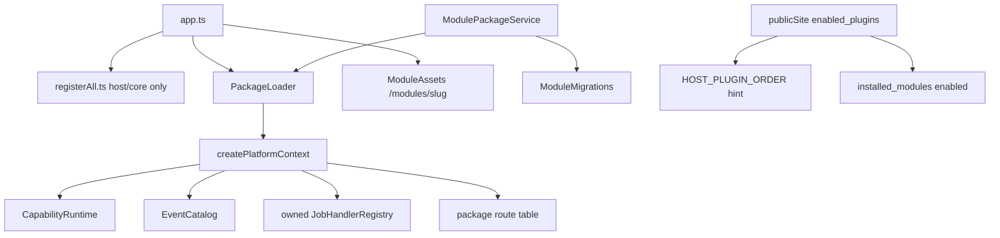

# Node package host foundation

**Status:** READY (synthetic unknown package proven)  
**Scope:** `runtime-node/` generic ZIP package host  
**PHP:** FROZEN — do not change for this workstream  
**Domain extraction:** COMPLETE — see `docs/node-domain-extraction.md`

## Goal

Node VPS runtime accepts an **unknown** ZIP package (no source whitelist edits) with:

- package migrations from `storage/modules/{slug}/migrations`
- safe FE assets at `/modules/{slug}/*`
- Node backend entry loaded with real `PlatformContext`
- EventCatalog / capabilities / jobs ownership + clear on disable/uninstall
- dynamic `/site` discovery from `installed_modules`
- SSRF-safe outbound (`http_ping` → `safeFetch`)

## Architecture

`registerAll.ts` / `moduleNames.ts` = host/core only.  
Extracted domains boot via `PackageLoader` + pure `register(PlatformContext)` (see `docs/node-domain-extraction.md`).

## Lifecycle

1. **upload** → quarantine ZIP (existing zipSafe)
2. **install** → extract to `storage/modules/{slug}` → registry `installed` → **apply package migrations** (fail → `failed`, not healthy)
3. **enable** → re-apply pending migrations → status `enabled` → `PackageLoader.load`
4. **load** → read manifest → resolve Node entry (`entrypoints.node` or `backend/index.mjs|js`) → `createPlatformContext` → `register(ctx)` → mark active  
   - missing Node entry = OK (FE/migrations-only package)  
   - invalid entry → quarantine (`failed` + `health=quarantined`), host stays up  
   - HTTP routes go into a **mutable route table** + `packageRouteDispatcher` middleware (Hono cannot add routes after the matcher is built)
5. **disable / uninstall** → `unload` → clear EventCatalog owner, capabilities, owned jobs, subscriptions, route table keys → `404`
6. **re-enable** → reload entry; re-populate route table

## PlatformContext (contract parity, not class parity)

Packages receive facades only (no `App\Core` / host internals):

| Facade | Role |
| --- | --- |
| `database()` | host DB |
| `events()` | bus + `declare` / catalog |
| `capabilities()` | host catalog + `provide` |
| `http()` | route register + SSRF `fetch` |
| `scheduler()` / `jobs()` | owned job handlers |
| `mail()` / `notifications()` | soft host primitives |
| `settings()` / `storage()` | module settings + jailed `.data/` |
| `permissions()` | soft capability probe |
| `config()` / `runtime()` | host config / `node-vps` |

## Dynamic discovery

`GET /site` → `enabled_plugins` =

1. host modules enabled via `modules` table (ordered by `HOST_PLUGIN_ORDER` ∩ `NODE_MODULE_NAMES`)  
2. **plus** enabled rows from `installed_modules` (any slug; health not failed/quarantined)

Unknown packages appear without editing `moduleNames.ts`, `registerAll.ts`, or host order lists.

## Assets

`GET /modules/{slug}/*` → files under `frontend-dist/` (fallback package root):

- path jail (`ModulePaths.assertContained`)
- traversal rejected
- only `status=enabled` and non-quarantined
- controlled 404 when missing/disabled

## Migrations

- Package SQL: `runtime-node/src/packages/ModuleMigrations.ts` → `storage/modules/{slug}/migrations`
- Host/plugin SQL still under `backend/src/Modules/*/migrations` via `pluginMigrationFiles()` (bundled leftovers only)
- Tracked in `module_migrations`; failure blocks enable / marks package failed

## Synthetic proof: `zed`

Fixture: `runtime-node/tests/fixtures/modules/zed/`  
ZIP artifact: `runtime-node/tests/fixtures/modules/jasefly-module-zed-1.0.0.zip` (written by test)  
Test: `runtime-node/tests/package-host-zed.test.ts`

**Must not appear in `runtime-node/src`.**

## Security

- `http_ping` uses `safeFetch` (SSRF guard) — no raw `fetch`
- Package outbound via `ctx.http().fetch` → same boundary
- ZIP path jail unchanged (`zipSafe` / `ModulePaths`)

## Remaining debt (before domain extraction)

- Extract 15 domain TS modules into ZIP Node entries (separate phase)
- Remove legacy static registration once packages own those domains
- Optional: content `resources()` facade if Node should own package content APIs
- MCP content CRUD catalog still lists blog/projects/products (operator UX debt)
